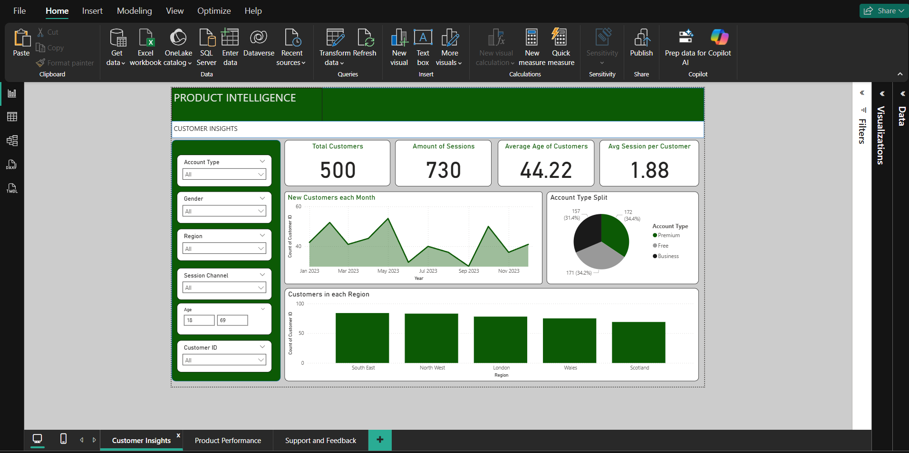
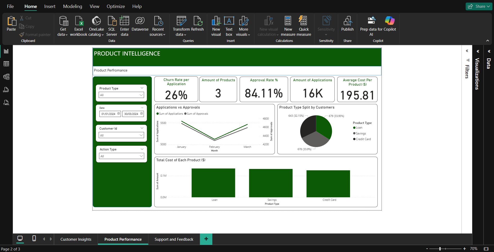
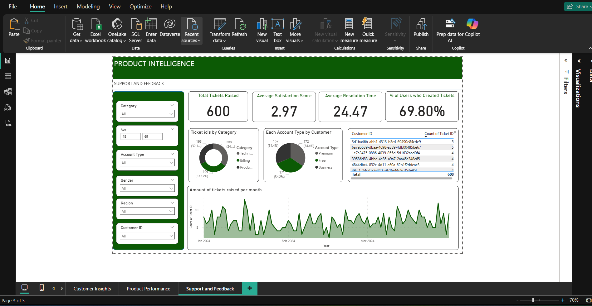

# Product Intelligence Report

This project analyzes simulated product and customer data for a financial services app to generate strategic insights into **product performance**, **customer behaviour**, and **support satisfaction**. The goal is to inform decisions that improve churn, engagement, and product success.

---

## Project Overview

The report is divided into two main parts:

### 1. SQL Analysis  
A series of SQL queries were written to explore:
- Churn rates by product
- Repeat usage patterns
- Approval rates
- Customer engagement
- Session duration by segment (age, gender, region, device)
- Support satisfaction vs. resolution time
- Indicators of upgrade from Free → Premium accounts

File: [`SQL/product_analysis.sql`](SQL/product_analysis.sql)

---

### 2. Power BI Dashboard  
Built to visually represent the findings from SQL and allow interactive exploration.

Tabs:
- **Customer Insights** – Segment app usage by demographics
- **Product Performance** – View churn, approval, and repeat usage
- **Support & Feedback** – Analyze satisfaction scores and support efficiency

Screenshots available in [`/screenshots`](screenshots)

  
  
  

---

## Key Questions Answered

- Which products have the **highest churn** or **repeat usage**?
- What features drive **longer session times**?
- Do mobile users behave differently from web users?
- What factors predict upgrades to **premium accounts**?
- How does support satisfaction relate to **resolution speed**?

---

## Tools Used

| Tool         | Purpose                              |
|--------------|--------------------------------------|
| **SQL**      | Data transformation and querying     |
| **Power BI** | Dashboard creation and storytelling  |
| **Excel/CSV**| Mock dataset generation              |

---

## Business Value

This report can help a fintech or digital bank:
- Improve product **adoption and retention**
- Target **high-value customer segments**
- Increase **premium conversion rates**
- Enhance support **efficiency and satisfaction**

---

## Notes

- All initial csv tables were AI-generated.
- All analysis and insights were independently created.
- Dashboards and visuals were built using Power BI Desktop.

---

