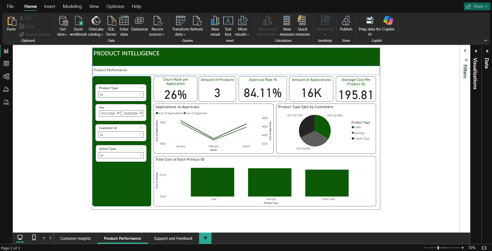

# 📊 Power BI Reports – Product Intelligence Dashboard

This folder contains a set of **Power BI dashboards** created to analyse customer usage, product performance, and support trends across a fictional financial platform. The reports are designed to reflect how a data analyst might monitor user behaviour and drive decision-making through data.

---

## 🗂️ Report Breakdown

### 1. 🧠 Customer Insights

- Total number of customers
- Session activity per customer
- Average customer age
- Regional distribution across the UK (e.g. South East, North West, Scotland)
- Monthly new customer sign-ups

---

### 2. 🚀 Product Performance

- Product **churn rate**
- **Approval rate** of products (e.g. Loans, Credit Cards)
- Application volumes over time
- Cost analysis per product
- Split of product types by customer

---

### 3. 💬 Support & Feedback

- Total support tickets raised
- Average **resolution time** and **satisfaction score**
- Types of support queries (Billing, Technical, Feature Requests)
- Ticket trends over time
- % of customers raising tickets by segment (Free vs Premium users)

---

## 🧭 Filter Options
Each dashboard is interactive and includes filters for:
- Product Type
- Date Range (DD/MM/YYYY)
- Account Type (Free, Premium, Business)
- Age
- Gender
- Region
- Customer ID

---

## 🛠 Tools Used
- **Microsoft Power BI Desktop (UK locale)**
- Data model built using:
  - `customers`
  - `product_performance`
  - `product_usage`
  - `support_tickets`
  - `app_sessions`
- Calculated columns and **DAX measures** used for KPIs

---

## 🎯 Purpose
These dashboards form part of a broader Product Intelligence project, aimed at:
- Monitoring customer trends
- Identifying product performance issues
- Improving customer support strategy

All data is artificial and was created for learning and demonstration purposes. Insights and calculations were conducted independently.

---

## 📎 Related Files
- SQL scripts used for data analysis and transformations can be found in the `/SQL` folder.

---
